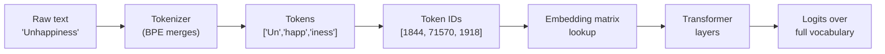
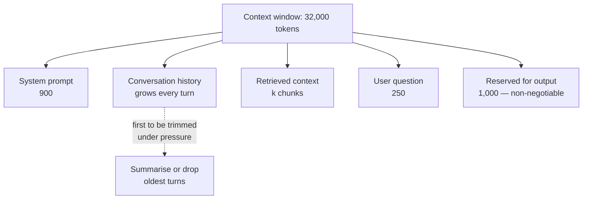
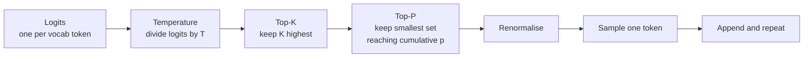

# Module 1 — The Core Mechanics

Almost every "prompt engineering" problem that survives more than an afternoon is really a mechanics problem wearing a costume. The model "forgets" the instruction you put in the middle. Your bill triples when you add Hindi support. The same prompt returns valid JSON nine times and prose the tenth.

None of those are mysteries. They are the predictable behaviour of three mechanisms: **how text becomes tokens**, **how tokens fill a context window**, and **how the model picks the next token**. This module covers all three at the level where you can predict the failure before it happens.

> **Prerequisites.** You can read Python or TypeScript and have called an LLM API at least once. No machine-learning background is assumed. Where math appears, it is arithmetic you can do on paper.

**By the end of this module you will be able to:**

- Explain why a model that "can't count letters in strawberry" is behaving correctly
- Compute the token cost of a feature before you build it, and cut it deliberately
- Lay out a context window so the important instruction is actually attended to
- Choose temperature, top-k, and top-p from the task rather than from folklore
- Explain why `temperature=0` is not the same thing as deterministic

---

## 1.1 What Is a Token?

A language model never sees your text. It sees a list of integers.

Between your string and the model sits a **tokenizer**: a deterministic, lossless, learned mapping between text and integer IDs. Everything downstream — cost, context limits, the model's strange blind spots around spelling and arithmetic — is a consequence of that mapping.



The tokenizer is chosen and frozen *before* the model is trained. The embedding matrix has exactly one row per vocabulary entry, so the vocabulary cannot change without retraining. This is why you cannot "add a token" to a deployed model.

### Why not just use characters or words?

The two obvious approaches both fail, and understanding *how* they fail explains why subword tokenization won.

| Approach | Vocabulary size | Sequence length | Fatal problem |
| --- | --- | --- | --- |
| **Characters** | ~100–150 | Very long | Attention cost grows with the square of length. A 2,000-word document becomes ~12,000 steps. |
| **Words** | 200k+ and still incomplete | Short | Every typo, product name, and unseen word becomes `UNK`, destroying information irrecoverably. |
| **Subwords** | 30k–200k | Moderate | None fatal — this is the winning trade-off. |

Subword tokenization keeps common words whole (`the`, `model`) and splits rare ones into reusable pieces (`tokeniz` + `ation`). Frequent text stays short; rare text stays *representable*.

### Byte-Pair Encoding (BPE), mechanically

BPE is a compression algorithm from 1994, repurposed for text. The training procedure is genuinely this simple:

1. Start with a vocabulary of every individual symbol in the corpus.
2. Count every adjacent pair of symbols.
3. Merge the single most frequent pair into one new symbol; record the merge.
4. Repeat until you reach your target vocabulary size.

The output is an **ordered list of merge rules**. Encoding new text means applying those merges, in the same order, until none apply.

Work through a tiny corpus. Suppose the words and their frequencies are `low` (5), `lower` (2), `newest` (6), `widest` (3). Split into characters with an end-of-word marker:

```text
l o w </w>          x5
l o w e r </w>      x2
n e w e s t </w>    x6
w i d e s t </w>    x3
```

Count adjacent pairs. The pair `e s` appears in `newest` (6) and `widest` (3) — 9 occurrences, the most frequent. Merge it.

| Step | Most frequent pair | Count | New symbol | Corpus after merge |
| --- | --- | --- | --- | --- |
| 1 | `e` + `s` | 9 | `es` | `n e w es t`, `w i d es t` |
| 2 | `es` + `t` | 9 | `est` | `n e w est`, `w i d est` |
| 3 | `est` + `</w>` | 9 | `est</w>` | `n e w est</w>`, `w i d est</w>` |
| 4 | `l` + `o` | 7 | `lo` | `lo w`, `lo w e r` |
| 5 | `lo` + `w` | 7 | `low` | `low`, `low e r` |

After five merges, `low` is a single token and `est</w>` is a single token. The algorithm discovered the morpheme `-est` without anyone teaching it English morphology. That is the whole idea: **statistical frequency approximates linguistic structure**, well enough and cheaply.

Here is BPE training implemented end to end, so the table above stops being hand-waving:

```python
from collections import Counter
from typing import Iterable

def train_bpe(corpus: dict[str, int], num_merges: int) -> list[tuple[str, str]]:
    """Learn BPE merge rules from a word-frequency dictionary.

    corpus: {"low": 5, "lower": 2, ...}
    returns: ordered merge rules, e.g. [("e", "s"), ("es", "t"), ...]
    """
    # Each word becomes a tuple of symbols, plus an end-of-word marker.
    vocab: dict[tuple[str, ...], int] = {
        tuple(word) + ("</w>",): freq for word, freq in corpus.items()
    }
    merges: list[tuple[str, str]] = []

    for _ in range(num_merges):
        pairs: Counter[tuple[str, str]] = Counter()
        for symbols, freq in vocab.items():
            for i in range(len(symbols) - 1):
                pairs[(symbols[i], symbols[i + 1])] += freq

        if not pairs:
            break

        best = max(pairs, key=lambda p: (pairs[p], p))  # deterministic tie-break
        merges.append(best)

        # Apply the merge everywhere it occurs.
        merged_vocab: dict[tuple[str, ...], int] = {}
        for symbols, freq in vocab.items():
            out, i = [], 0
            while i < len(symbols):
                if i < len(symbols) - 1 and (symbols[i], symbols[i + 1]) == best:
                    out.append(symbols[i] + symbols[i + 1])
                    i += 2
                else:
                    out.append(symbols[i])
                    i += 1
            merged_vocab[tuple(out)] = freq
        vocab = merged_vocab

    return merges


def apply_bpe(word: str, merges: list[tuple[str, str]]) -> list[str]:
    """Encode a single word by replaying merges in learned order."""
    symbols = list(word) + ["</w>"]
    for a, b in merges:
        out, i = [], 0
        while i < len(symbols):
            if i < len(symbols) - 1 and symbols[i] == a and symbols[i + 1] == b:
                out.append(a + b)
                i += 2
            else:
                out.append(symbols[i])
                i += 1
        symbols = out
    return symbols


if __name__ == "__main__":
    rules = train_bpe({"low": 5, "lower": 2, "newest": 6, "widest": 3}, num_merges=10)
    print(rules[:5])                  # the merges from the table above
    print(apply_bpe("lowest", rules)) # generalises to an unseen word
```

Note the last line: `lowest` never appeared in training, yet it encodes cleanly as `low` + `est</w>`. **Compositionality is the payoff.**

### Byte-level BPE, and why `UNK` disappeared

Classic BPE has a hole: if a character never appeared in training — an emoji, a Devanagari glyph, a control byte — it cannot be represented. GPT-2 fixed this by running BPE over **raw UTF-8 bytes** rather than Unicode characters.

There are exactly 256 possible bytes, so the base vocabulary is complete by construction. Every possible input is encodable.

> **This is why modern models have no `UNK` token.** Any byte sequence — corrupted input, a novel emoji, a language absent from training — is representable. It may cost many tokens, but it is never lost.

The cost is that non-Latin scripts fragment. A Latin character is one byte; a Devanagari or CJK character is typically three. Before merges are learned for those scripts, each character can consume multiple tokens.

### WordPiece and Unigram: the other two families

BPE is not the only option, and the differences matter when you are choosing an open model or an embedding model.

**WordPiece** (BERT, DistilBERT) uses the same merge-based structure, but selects merges by **likelihood gain** rather than raw frequency. For a candidate pair, it maximises:

```text
score(a, b) = freq(ab) / (freq(a) * freq(b))
```

The denominator penalises merging two symbols that are each already common. Frequency-based BPE will happily merge `t` + `h` because both are everywhere; WordPiece resists, preferring merges that are *informative*. WordPiece marks continuation with `##`, so `unhappiness` becomes `un`, `##happi`, `##ness`.

**Unigram** (SentencePiece; used by T5 and the Llama family) works backwards. It starts with a large candidate vocabulary and **prunes**, iteratively removing the tokens whose removal least damages the likelihood of the corpus under a unigram language model. It keeps a probability per token, so it can consider *multiple valid segmentations* and pick the most probable — and, during training, sample among them for regularisation.

| Property | BPE (byte-level) | WordPiece | Unigram (SentencePiece) |
| --- | --- | --- | --- |
| **Direction** | Bottom-up merging | Bottom-up merging | Top-down pruning |
| **Merge criterion** | Highest pair frequency | Highest likelihood gain | Least likelihood loss when removed |
| **Handles any input** | Yes, by construction | Needs byte fallback | Needs byte fallback |
| **Continuation marker** | Whitespace in token, e.g. `" the"` | `##` prefix | `▁` for word start |
| **Multiple segmentations** | No, deterministic | No, deterministic | Yes, probabilistic |
| **Used by** | GPT family, many open models | BERT family | T5, Llama family |

> **Tip.** When you swap embedding models, you are usually swapping tokenizers too. Token counts, and therefore your chunk sizes and costs, will shift. Re-measure; never assume the old numbers carry over.

### The consequences you will actually hit

The mechanics above produce a set of behaviours that look like model stupidity and are in fact tokenizer artefacts.

- **Whitespace belongs to the token.** In GPT-family tokenizers, `" the"` (with the leading space) and `"the"` are *different tokens with different IDs*. A prompt ending in a trailing space forces the model into a different, rarer branch of the distribution and measurably degrades output.
  - Practical rule: **never end a prompt with a trailing space or newline** before generation.
- **Models cannot see letters.** `strawberry` may be a single token. Asking the model to count the letter `r` is asking it to introspect the internals of one opaque integer. The failure is structural, not a reasoning gap.
  - Fix by making structure visible: `s-t-r-a-w-b-e-r-r-y`, or delegate to code.
- **Numbers fragment unpredictably.** `1000` might be one token while `1001` is two, and the split points are not consistent across magnitudes. This is a real contributor to arithmetic errors.
  - Fix: give the model a calculator tool. Do not prompt-engineer around arithmetic.
- **Non-English text costs multiples.** The same sentence in Hindi, Arabic, or Japanese can consume two to four times the tokens of its English equivalent, because merges were learned overwhelmingly on English.
- **JSON and code are token-hungry.** Braces, quotes, and indentation are all tokens. Deeply nested JSON output can spend a third of its tokens on punctuation. Flatter schemas and shorter key names are a real cost lever at scale.

### Counting tokens, and converting tokens to money

Estimation heuristics are fine for a back-of-envelope (roughly **4 characters** or **0.75 words** per token for English prose) but you should count exactly wherever the number touches a budget or a truncation decision.

```python
import tiktoken

# Match the encoding to the model family you are actually calling.
enc = tiktoken.get_encoding("cl100k_base")

def count_tokens(text: str) -> int:
    return len(enc.encode(text))

def inspect(text: str) -> list[str]:
    """See the actual split — invaluable when debugging odd behaviour."""
    return [enc.decode([tid]) for tid in enc.encode(text)]

print(inspect("Unhappiness costs $1001."))
# ['Un', 'happ', 'iness', ' costs', ' $', '100', '1', '.']
#  note: the leading spaces, and 1001 splitting into '100' + '1'


def estimate_cost(
    input_tokens: int,
    output_tokens: int,
    input_price_per_mtok: float,
    output_price_per_mtok: float,
) -> float:
    """Cost of one call. Prices are per 1,000,000 tokens — check your
    provider's current rates rather than hard-coding them."""
    return (
        input_tokens / 1_000_000 * input_price_per_mtok
        + output_tokens / 1_000_000 * output_price_per_mtok
    )
```

The TypeScript equivalent, for the same job on the server side:

```ts
import { encoding_for_model, type TiktokenModel } from "tiktoken";

export function countTokens(text: string, model: TiktokenModel): number {
  const enc = encoding_for_model(model);
  try {
    return enc.encode(text).length;
  } finally {
    enc.free(); // WASM allocation — always release it
  }
}

export interface Pricing {
  /** Price per 1,000,000 input tokens. */
  inputPerMTok: number;
  /** Price per 1,000,000 output tokens. */
  outputPerMTok: number;
}

export function estimateCost(
  inputTokens: number,
  outputTokens: number,
  pricing: Pricing,
): number {
  return (
    (inputTokens / 1_000_000) * pricing.inputPerMTok +
    (outputTokens / 1_000_000) * pricing.outputPerMTok
  );
}
```

> **Warning.** `enc.free()` is not optional in the WASM build. A tokenizer allocated per request and never freed is a slow memory leak that will take down a long-running Node process. Allocate once per encoding and reuse it, or free it in a `finally`.

### The cost model that actually predicts your bill

Per-call cost is the easy part. What surprises teams is the **multipliers**.

```text
monthly_cost
  = calls_per_month
  * ( (fixed_prompt_tokens + variable_input_tokens) * input_rate
    + expected_output_tokens * output_rate )
  * retry_factor
```

A worked example. Suppose a support assistant handles 100,000 requests a month with:

- a 900-token system prompt (fixed, sent every call)
- ~1,600 tokens of retrieved context
- ~250 tokens of user question
- ~350 tokens of answer
- a 1.05 retry factor (5 percent of calls retried)

That is 2,750 input tokens and 350 output tokens per call. At an illustrative **$3.00 per Mtok input** and **$15.00 per Mtok output**:

| Component | Tokens/call | Calls | Rate | Monthly |
| --- | --- | --- | --- | --- |
| System prompt | 900 | 100k | $3.00/Mtok | $270 |
| Retrieved context | 1,600 | 100k | $3.00/Mtok | $480 |
| User question | 250 | 100k | $3.00/Mtok | $75 |
| Output | 350 | 100k | $15.00/Mtok | $525 |
| **Subtotal** | | | | **$1,350** |
| Retries (5%) | | | | **$67.50** |
| **Total** | | | | **~$1,418** |

Read the table as a list of levers, and note which ones are large:

- **The system prompt costs $270/month for text that never changes.** This is the single most common waste in production LLM apps. Prompt caching, where the provider supports it, can cut the repeated-prefix portion dramatically — and it is nearly free to adopt because the prefix is already stable.
- **Retrieved context is the biggest input line.** Dropping from `k=8` to `k=5` chunks removes roughly $180/month here, and frequently *improves* answer quality (see 1.2).
- **Output is the most expensive per token** — commonly 3–5× the input rate. "Answer in at most three sentences" is a cost control, not just a style note.

> **Tip.** Instrument `input_tokens` and `output_tokens` per request from day one, tagged by feature. You cannot optimise a bill you cannot attribute, and provider dashboards aggregate away exactly the detail you need.

---

## 1.2 Context Windows

The **context window** is the maximum number of tokens the model can attend to in a single forward pass. It is not "input length" — it is the ceiling on **input plus generated output together**.

That detail causes a specific, very common production bug:

> **Warning.** If your input consumes the entire window, the model has no room left to answer. Depending on the provider you will get an empty completion, a hard error, or a response truncated mid-word. **Always reserve output tokens as part of the budget**, before you decide how much context to include.

### Why windows are finite

Self-attention compares every token with every other token. For a sequence of `n` tokens, that is `n²` pairwise scores per attention head per layer.

| Sequence length | Relative attention cost |
| --- | --- |
| 1,000 | 1× |
| 4,000 | 16× |
| 16,000 | 256× |
| 128,000 | 16,384× |

Doubling the context quadruples the attention work. Modern long-context models mitigate this with architectural tricks — sparse and sliding-window attention, grouped-query attention, better positional encodings — but the underlying pressure never goes away. **A long window is a budget you are spending, not free space.**

### The budget equation

Every request is a zero-sum allocation:

```text
system_prompt + conversation_history + retrieved_context + user_question
  + reserved_output  ≤  context_window
```



The only genuinely elastic component is history. Decide *in advance* what gets trimmed, because under pressure something will be — and if you have not chosen, the provider will choose for you by truncating the end, which is where your question lives.

### "Lost in the Middle"

Here is the finding that most changes how you lay out a prompt. Research on long-context retrieval (Liu et al., 2023, *Lost in the Middle: How Language Models Use Long Contexts*) showed that model accuracy depends heavily on **where in the context** the relevant information sits.

Plot accuracy against position and you get a **U-shaped curve**: strong at the beginning (primacy), strong at the end (recency), and a pronounced sag in the middle.

| Position of the answer-bearing passage | Relative retrieval accuracy |
| --- | --- |
| First | Highest |
| 25% through | Noticeably lower |
| Middle | **Lowest — the trough** |
| 75% through | Recovering |
| Last | High, near the peak |

The effect is strong enough that in some configurations, a model given *more* documents performed *worse* than one given fewer, because the extra material pushed the relevant passage into the trough.

**What follows from this, concretely:**

- **Put instructions at the very start, and repeat the critical constraint at the very end.** The end of the prompt is prime real estate; spending it on the actual task instruction is almost always correct.
- **Rerank so the best-scoring chunk is first — and consider placing the second-best last.** Both ends beat the middle.
- **Fewer, better chunks beat more chunks.** This is the same conclusion the cost model reached from a different direction, which is a good sign it is right.
- **Never bury the user's actual question in the middle of a wall of retrieved context.**

> **Tip.** If quality drops after you increase `k`, do not immediately blame the model or the embeddings. Test the same `k` with the known-good chunk pinned to position one. If accuracy recovers, you have a positional problem, not a retrieval problem.

### Conversation memory strategies

A chat application accumulates history forever, but the window does not grow. Four strategies, with honest trade-offs:

| Strategy | How it works | Keeps | Loses | Best for |
| --- | --- | --- | --- | --- |
| **Sliding window** | Keep the last N turns | Recent detail, exactly | Everything older, abruptly | Short task-oriented chats |
| **Summarisation buffer** | Summarise old turns, keep recent verbatim | The thread of the conversation | Specific details inside summaries | Long assistant conversations |
| **Vector memory** | Embed past turns, retrieve relevant ones | Any past detail, on demand | Continuity and ordering | Assistants with long user histories |
| **Hybrid** | Rolling summary + retrieval + recent verbatim | Most things | Complexity budget | Production assistants |

> **Warning.** Naive sliding windows silently drop the system prompt when the history grows past the limit, because it is the oldest message. The assistant appears to "lose its personality" mid-conversation. **Pin the system prompt outside the trimmable region.**

Here is a budget manager that handles both traps — reserving output space and pinning the system message:

```python
from dataclasses import dataclass
import tiktoken

enc = tiktoken.get_encoding("cl100k_base")

@dataclass
class Message:
    role: str
    content: str

    @property
    def tokens(self) -> int:
        # Per-message overhead for role and delimiters. Verify the exact
        # figure against your provider's documented format.
        return len(enc.encode(self.content)) + 4


def fit_to_window(
    system: Message,
    history: list[Message],
    question: Message,
    *,
    context_window: int,
    reserve_output: int,
) -> list[Message]:
    """Trim oldest history until everything fits, never dropping the
    system prompt, the question, or the space needed to answer."""
    fixed = system.tokens + question.tokens + reserve_output
    if fixed > context_window:
        raise ValueError(
            f"System prompt and question alone need {fixed} tokens, "
            f"exceeding the {context_window}-token window."
        )

    budget = context_window - fixed
    kept: list[Message] = []
    used = 0

    # Walk backwards: most recent turns are the most valuable.
    for msg in reversed(history):
        if used + msg.tokens > budget:
            break
        kept.append(msg)
        used += msg.tokens

    return [system, *reversed(kept), question]
```

The TypeScript version, written the way you would actually ship it — trimming in whole turns so a user message never survives without its assistant reply:

```ts
export interface ChatMessage {
  role: "system" | "user" | "assistant";
  content: string;
}

export interface WindowBudget {
  contextWindow: number;
  reserveOutput: number;
  countTokens: (text: string) => number;
}

const PER_MESSAGE_OVERHEAD = 4;

export function fitToWindow(
  system: ChatMessage,
  history: ChatMessage[],
  question: ChatMessage,
  { contextWindow, reserveOutput, countTokens }: WindowBudget,
): ChatMessage[] {
  const size = (m: ChatMessage) => countTokens(m.content) + PER_MESSAGE_OVERHEAD;

  const fixed = size(system) + size(question) + reserveOutput;
  if (fixed > contextWindow) {
    throw new Error(
      `System prompt and question need ${fixed} tokens, over the ${contextWindow} window.`,
    );
  }

  let budget = contextWindow - fixed;
  const kept: ChatMessage[] = [];

  // Walk backwards in PAIRS so a user turn never loses its answer.
  for (let i = history.length - 1; i >= 0; i -= 2) {
    const pair = history.slice(Math.max(0, i - 1), i + 1);
    const cost = pair.reduce((sum, m) => sum + size(m), 0);
    if (cost > budget) break;
    kept.unshift(...pair);
    budget -= cost;
  }

  return [system, ...kept, question];
}
```

### Production edge cases

- **Tool outputs are unbounded.** A tool returning a 40,000-token API response will blow the window in one step. **Truncate tool results before they re-enter the context**, and prefer tools that return structured summaries over raw payloads.
- **Cost in a chat app grows quadratically.** Every turn resends the whole history, so turn `n` costs proportional to `n`, and the conversation total to `n²`. A 50-turn conversation is far more expensive than fifty single questions.
- **Prompt caching rewards stable prefixes.** Providers that cache a common prefix can serve it far more cheaply. This makes prefix *order* an architectural decision: put the immovable system prompt and static instructions first, and all variable content last.
- **Streaming does not reduce cost.** It improves perceived latency. You still pay for every generated token.
- **Token counts differ between your tokenizer and the provider's accounting.** Message formatting, role markers, and tool schemas all add overhead. Leave headroom of a few percent rather than budgeting to the exact limit.

---

## 1.3 Temperature, Top-K, and Top-P

At each step, the model produces a **logit** — an unnormalised score — for every token in its vocabulary. A 100,000-token vocabulary means 100,000 logits, every step.

Those logits are not probabilities. Turning them into a choice is **decoding**, and it is entirely under your control. The model is unchanged; the sampling policy is a dial on the output.



### The softmax, and what temperature does to it

Logits become probabilities through the **softmax**:

```text
P(token_i) = exp(z_i / T) / Σ_j exp(z_j / T)
```

`z_i` is the logit; `T` is the temperature. Temperature divides the logits *before* exponentiation, and that single division is the entire mechanism.

Work it numerically. Take four candidate tokens with logits `[3.0, 2.0, 1.0, 0.5]`:

| Token | Logit | T = 0.5 | T = 1.0 | T = 2.0 |
| --- | --- | --- | --- | --- |
| A | 3.0 | **0.842** | 0.605 | 0.406 |
| B | 2.0 | 0.114 | 0.223 | 0.246 |
| C | 1.0 | 0.015 | 0.082 | 0.149 |
| D | 0.5 | 0.006 | 0.050 | 0.116 |

Read across the rows:

- **Low temperature sharpens.** At `T = 0.5`, token A takes 84 percent of the mass. The distribution concentrates on what the model already preferred.
- **`T = 1.0` is the model's own distribution**, unmodified.
- **High temperature flattens.** At `T = 2.0`, D has climbed from 5 percent to 12 percent. Unlikely tokens become genuinely reachable — which is creativity, and also how you get nonsense.

As `T` approaches 0, the distribution approaches a spike on the single highest logit. That is **greedy decoding**: always take the argmax.

> **Warning: `temperature=0` is not "deterministic" in production.** It removes *sampling* randomness, but identical inputs can still produce different outputs because of floating-point non-associativity across different batch sizes, GPU kernel scheduling, mixture-of-experts routing that depends on batch composition, and silent model updates behind a versioned endpoint. Treat `T=0` as *maximally consistent*, not *reproducible*. If you need reproducibility, pin a model version, pass a seed where supported, and **still write tests that assert on properties rather than exact strings**.

### Top-K: a fixed-size shortlist

Top-K truncation keeps only the `K` highest-probability tokens, zeroes the rest, and renormalises.

Its weakness is that `K` is fixed while the distribution is not:

- After `"The capital of France is"`, the model is nearly certain. `K = 50` drags in 49 wrong answers as live options.
- Mid-sentence in creative prose, hundreds of continuations are reasonable. `K = 50` cuts off legitimate variety.

**Top-K cannot adapt to the model's confidence.** That limitation is exactly what top-p was invented to fix.

### Top-P (nucleus sampling): an adaptive shortlist

Top-P sorts tokens by probability and keeps the **smallest set whose cumulative probability reaches `p`**. That set — the "nucleus" — grows and shrinks automatically with the model's certainty.

With `p = 0.9` and our four tokens at `T = 1.0` (`0.605, 0.223, 0.082, 0.050`):

- A alone: 0.605 — under 0.9, keep going
- A + B: 0.828 — still under
- A + B + C: 0.910 — reached, stop

The nucleus is `{A, B, C}`; D is discarded. Where the model is confident, the nucleus might be a single token; where it is uncertain, it might be hundreds. **The shortlist size follows the model's own confidence**, which is precisely what you want.

| Parameter | Controls | Adapts to confidence? | Typical range | Failure mode when pushed |
| --- | --- | --- | --- | --- |
| **Temperature** | Sharpness of the whole distribution | No — reshapes uniformly | 0.0 – 1.2 | Too high: incoherence. Too low: repetition loops |
| **Top-K** | Fixed shortlist size | No | 20 – 100 | Too low: bland. Too high: no real filtering |
| **Top-P** | Cumulative probability mass | **Yes** | 0.85 – 0.98 | Too low: repetitive. Near 1.0: no filtering |

Implemented from scratch, so the math above is concrete rather than described:

```python
import numpy as np

def sample_next_token(
    logits: np.ndarray,
    temperature: float = 1.0,
    top_k: int | None = None,
    top_p: float | None = None,
    rng: np.random.Generator | None = None,
) -> int:
    """Reference implementation of the standard decoding pipeline.
    Order matters: temperature, then top-k, then top-p, then sample."""
    rng = rng or np.random.default_rng()

    # Greedy decoding: temperature 0 means argmax, not division by zero.
    if temperature <= 0:
        return int(np.argmax(logits))

    # 1. Temperature scales the logits BEFORE softmax.
    logits = logits / temperature

    # Subtract the max for numerical stability: exp(1000) overflows.
    probs = np.exp(logits - np.max(logits))
    probs /= probs.sum()

    # 2. Top-K: keep the K highest, zero the rest.
    if top_k is not None and 0 < top_k < len(probs):
        cutoff = np.partition(probs, -top_k)[-top_k]
        probs = np.where(probs < cutoff, 0.0, probs)
        probs /= probs.sum()

    # 3. Top-P: smallest set whose cumulative mass reaches p.
    if top_p is not None and 0.0 < top_p < 1.0:
        order = np.argsort(probs)[::-1]
        cumulative = np.cumsum(probs[order])
        # Keep everything up to and including the token that crosses p.
        keep = order[: int(np.searchsorted(cumulative, top_p) + 1)]
        mask = np.zeros_like(probs, dtype=bool)
        mask[keep] = True
        probs = np.where(mask, probs, 0.0)
        probs /= probs.sum()

    return int(rng.choice(len(probs), p=probs))
```

And in TypeScript, for a Node service implementing its own decoding over a local model:

```ts
export interface SamplingOptions {
  temperature?: number;
  topK?: number;
  topP?: number;
  random?: () => number;
}

export function sampleNextToken(
  logits: number[],
  { temperature = 1.0, topK, topP, random = Math.random }: SamplingOptions = {},
): number {
  // Greedy path.
  if (temperature <= 0) {
    return logits.reduce((best, v, i) => (v > logits[best]! ? i : best), 0);
  }

  // 1. Temperature, then a numerically stable softmax.
  const scaled = logits.map((z) => z / temperature);
  const max = Math.max(...scaled);
  const exps = scaled.map((z) => Math.exp(z - max));
  const total = exps.reduce((a, b) => a + b, 0);
  let probs = exps.map((e) => e / total);

  // Indices sorted by descending probability — reused by both filters.
  const order = probs
    .map((p, i) => ({ p, i }))
    .sort((a, b) => b.p - a.p);

  const keep = new Set<number>();

  // 2. Top-K.
  const kLimit = topK && topK > 0 ? Math.min(topK, order.length) : order.length;
  for (let i = 0; i < kLimit; i++) keep.add(order[i]!.i);

  // 3. Top-P, applied within the surviving set.
  if (topP !== undefined && topP > 0 && topP < 1) {
    const nucleus = new Set<number>();
    let cumulative = 0;
    for (const { p, i } of order) {
      if (!keep.has(i)) continue;
      nucleus.add(i);
      cumulative += p;
      if (cumulative >= topP) break; // include the token that crosses p
    }
    keep.clear();
    for (const i of nucleus) keep.add(i);
  }

  // Renormalise over survivors.
  let kept = 0;
  probs = probs.map((p, i) => (keep.has(i) ? ((kept += p), p) : 0));
  probs = probs.map((p) => p / kept);

  // Inverse-transform sampling.
  let r = random();
  for (let i = 0; i < probs.length; i++) {
    r -= probs[i]!;
    if (r <= 0) return i;
  }
  return probs.length - 1;
}
```

### Choosing settings from the task

Folklore says "0.7 is a good default". Reason from the task instead — what does a wrong answer cost you?

| Task | Temperature | Top-P | Why |
| --- | --- | --- | --- |
| Classification, extraction, routing | **0.0** | 1.0 | One correct answer exists. Variation is pure defect. |
| Structured output (JSON, SQL) | **0.0 – 0.2** | 1.0 | Schema validity outranks expressiveness. |
| Factual Q&A over retrieved context | **0.0 – 0.3** | 0.9 | Grounded answers should not wander. |
| Summarisation | **0.3 – 0.5** | 0.9 | Slight flexibility in phrasing, faithful content. |
| Conversational assistant | **0.6 – 0.8** | 0.95 | Natural variation without losing the thread. |
| Creative writing, ideation | **0.9 – 1.1** | 0.95 – 1.0 | Surprise is the product. |
| Generating diverse candidates to rank | **1.0+** | 0.98 | You want spread; a separate scorer picks the winner. |

> **Tip.** Most providers advise tuning **either** temperature **or** top-p, not both. They are two ways of controlling the same thing, and moving both makes the effect hard to reason about. Fix `top_p = 1.0` and tune temperature until you have a reason to do otherwise.

### The parameters nobody mentions until something breaks

- **Frequency penalty** subtracts from a token's logit in proportion to how often it has already appeared. Useful against verbatim repetition; too high and the model starts avoiding necessary words like the subject of the sentence.
- **Presence penalty** applies a flat penalty once a token has appeared at all, pushing toward new topics rather than discouraging repeats specifically.
- **Repetition penalty** (common in open-source stacks) divides logits of seen tokens. Note it interacts badly with code generation, where repeated syntax is *correct*.
- **Stop sequences** end generation on a literal string. The cheapest possible cost control, and consistently underused.
- **`max_tokens`** is a hard cut, not a hint. Setting it too low truncates mid-JSON and produces unparseable output. Set it from the *longest legitimate* response, not the typical one.
- **Seed**, where supported, makes sampling reproducible *given identical everything else* — see the determinism warning above.

> **Warning: the low-temperature repetition trap.** At very low temperatures, models can enter a degenerate loop, repeating a phrase indefinitely, because the highest-probability continuation after a phrase is that same phrase. If you see loops at `T = 0`, do not raise the temperature first — add a stop sequence, a modest frequency penalty, or a `max_tokens` ceiling. Raising temperature trades one defect for another.

---

## Module Recap

- A model consumes **integer token IDs**, not text. Tokenization is learned, frozen before training, and the source of the model's blind spots around spelling and arithmetic.
- **BPE merges by frequency, WordPiece by likelihood gain, Unigram by pruning.** Byte-level BPE eliminated the `UNK` token by making every byte sequence representable.
- **Cost is arithmetic, not mystery.** Fixed system prompts, retrieved context size, and output length are the three levers; output tokens are the most expensive per unit.
- The context window bounds **input plus output together**. Always reserve output tokens before deciding how much context to include.
- **"Lost in the middle" is real and U-shaped.** Put instructions first, restate the critical constraint last, and prefer fewer, better-ranked chunks.
- **Temperature reshapes the whole distribution; top-k truncates to a fixed size; top-p truncates to adaptive mass.** Tune one, not all three.
- **`temperature=0` means maximally consistent, never guaranteed reproducible.**

## Exercises

1. **Tokenizer archaeology.** Encode these and inspect the splits: an English sentence, the same sentence in Hindi, a nested JSON object, a UUID, and `1000` through `1010`. Record the token count of each. Explain, in one sentence per case, why the ratios differ.
2. **Build the bill.** For a feature you are actually planning, write out the cost equation from 1.1 with real token counts you measured. Then find $200/month of savings without degrading quality, and state which lever you pulled.
3. **Reproduce the trough.** Assemble ten paragraphs where exactly one answers a question. Ask the model with that paragraph at position 1, position 5, and position 10. Run each five times. Report accuracy by position.
4. **Feel the temperature.** Take the logits `[3.0, 2.0, 1.0, 0.5]` and compute the softmax by hand at `T = 0.5`, `1.0`, and `2.0`. Verify against the table in 1.3, then verify against the code.

---

**Next:** *Module 2 — Advanced Prompt Pipelines and Guardrails*, where these mechanics become architecture: decomposition, chaining, structured-output enforcement, and the validation layer that keeps a probabilistic component safe inside a deterministic system.
